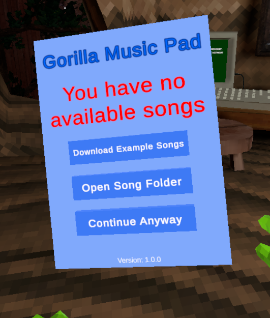
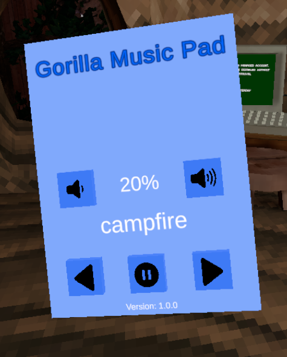

# GorillaMusicPad-GT
A BepInEx mod for Gorilla Tag that brings a music player pad to the game. Import your songs and listen to them while you play!\
If you find a bug or issue with this mod please make an issue in the [Issues Tab](https://github.com/lolcaf/GorillaMusicPad-GT/issues)
## How To Use
### Introduction
When you start the game you will be greeted with this page\
\
You have the choice to download 3 example songs (Gorilla Tag OST), open the song folder (Where you import your own songs) or continue anyway.
### Main Screen
\
Once you meet the main screen you can change which song is selected, pause/unpause and change the volume.
## Import Your Songs
The mod creates a folder next to `Gorilla Tag.exe` called "GorillaMusicPad".\
Place your own audio files into GorillaMusicPad/Music folder and you're done!\
This mod supports most common audio file types.
```
Gorilla Tag
-Gorilla Tag.exe
-GorillaMusicPad
--Music
---your song here
```
## Disclaimer
This product is not affiliated with Another Axiom Inc. or its videogames Gorilla Tag and Orion Drift and is not endorsed or otherwise sponsored by Another Axiom. Portions of the materials contained herein are property of Another Axiom. ©2021 Another Axiom Inc.
